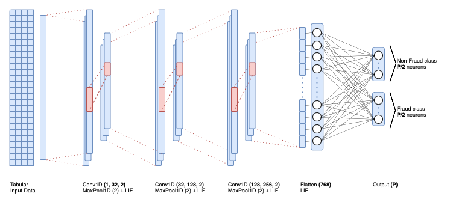

# Exploring Neural Joint Activity in Spiking Neural Networks for Fraud Detection

[](https://doi.org/10.5281/zenodo.13546087)

Source code of the paper accepted at CIARP 2024, the 27th IberoAmerican Congress on Pattern Recognition. 

## Paper Abstract
Spiking Neural Networks (SNNs), inspired by the real brain's behavior, offer an energy-efficient alternative to traditional artificial neural networks coupled with their neural joint activity, also referred to as population coding. This population coding is replicated in SNNs by attributing more than one neuron to each class in the output layer. This study leverages SNNs for fraud detection through real-world datasets, namely the Bank Account Fraud dataset suite, addressing the fairness and bias issues inherent in conventional machine learning algorithms. Different configurations of time steps and population sizes were compared within a 1D-Convolutional Spiking Neural Network, whose hyperparameters were optimized through a Bayesian optimization process.
Our proposed SNN approach with neural joint activity enables the classification of fraudulent opening of bank accounts more accurately and fairly than standard SNNs. The results highlight the potential of SNNs to surpass non-population coding baselines by achieving an average of 47.08% of recall at a business constraint of 5% of false positive rate, offering a robust solution for fraud detection. Moreover, the proposed approach attains comparable results to gradient-boosting machine models while maintaining predictive equality towards sensitive attributes above 90%.

**Keywords:** Spiking Neural Networks $\cdot$ Population Coding $\cdot$ Fraud Detection $\cdot$ Energy Efficiency $\cdot$ Responsible AI $\cdot$ Fair ML



## Installation

To install the required packages, run the following command:
```bash
pip install -r requirements.txt
```
Download the six Variant of the Bank Account Fraud (BAF) Dataset and extract the parquet files to the data folder.

## Dataset

The Bank Account Fraud (BAF) dataset is a synthetic dataset based on real-world data that simulates bank account opening applications. The dataset contains 6 parquet files, each representing a different variant of the dataset (Base, Variant I, Variant II, Variant III, Variant IV, and Variant V). It contains 30 features and a binary target variable indicating whether the application is fraudulent or not.

## Repository Structure

The repository is structured as follows:
- [`data`](./data/README.md): Contains the Bank Account Fraud dataset.
- [`images`](./images): Contains the images used in this README file.
- [`src`](./src): Contains the source code of the project.
    - [`modules`](./src/modules): Contains the utilitary files used in the project.
    - [`get_best_hyperparams.ipynb`](./src/get_best_hyperparams.ipynb): Jupyter notebook to find the best combinations of hyperparameters for the 1D-Convolutional Spiking Neural Network architectures.
    - [`get_metrics.ipynb`](./src/get_metrics.ipynb): Jupyter notebook to find the metrics for each architecture.
    - [`main_evaluation.py`](./src/main_evaluation.py): Main script to run the experimentation that repeats the classification multiple times for each dataset.
    - [`main_optimization.py`](./src/main_optimization.py): Main script to run the Bayesian optimization of the architectures with population coding.
    - [`plot_pareto_front.ipynb`](./src/plot_pareto_front.ipynb): Jupyter notebook to plot the Pareto front of the optimized architectures.
    - [`plot_scatter.ipynb`](./src/plot_scatter.ipynb): Jupyter notebook to plot the scatter plot of the evaluation experimentation.
    - [`plot_tradeoff.ipynb`](./src/plot_tradeoff.ipynb): Jupyter notebook to plot the tradeoff between the performance and fairness metrics.

## Bibtex

To cite this work, use the following bibtex entry:
```bibtex
@inproceedings{perdigao2024, 
    title={Exploring Neural Joint Activity in Spiking Neural Networks for Fraud Detection},
    author={Perdigão, Dylan and Antunes, Francisco and Silva, Catarina and Ribeiro, Bernardete},
    booktitle={Progress in Pattern Recognition, Image Analysis, Computer Vision, and Applications},
    series={Lecture Notes in Computer Science},
    volume={15368}, 
    ISBN={978-3-031-76607-7}, 
    publisher={Springer Cham},
    year={2024},
}
```

## Issues

This code is imported and adapted from the original research repository. Consequently, the code may contain bugs or issues.
If you encounter any issues while running the code, please open an issue in the repository.

